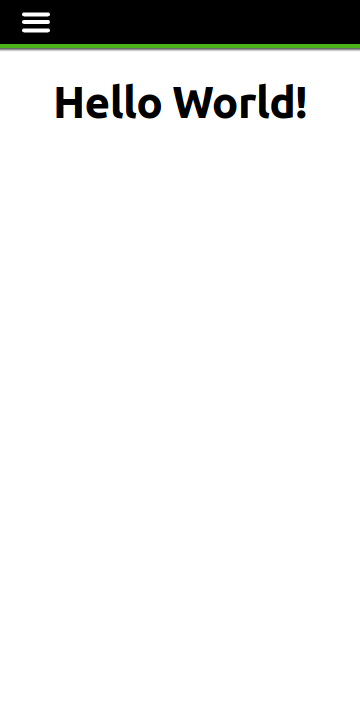
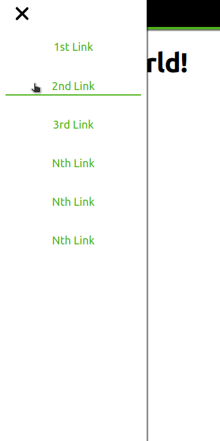
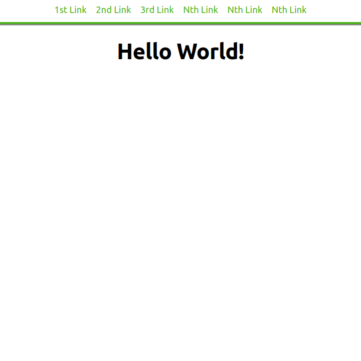

## Screenshots

Remember that these screenshots had a specific configuration. \
Your setup may look different depending on your preferences.

<details>
  <summary>Mobile Navigation (Closed)</summary>



</details>

<details>
  <summary>Mobile Navigation (Open)</summary>



</details>

<details>
  <summary>Desktop Navigation (No Logo — Tablet)</summary>



</details>


## Setup:

1. Clone this repo
2. Modify master.scss and \_variables.scss from the SCSS directory to your needs
3. Add this to your webpages before any content in `body`:

```html
<nav>
  <!-- Input of type checkbox -->
  <input type="checkbox" id="hamburger-button" />
  <!--   Hamburger button | Changes check state of input-->
  <label for="hamburger-button"><span></span></label>
  <!-- Image/Logo here -->
  <div class="nav-menu">
    <ul>
      <!-- Items (Links) -->
      <li><a href="#">1st Link</a></li>
      <li><a href="#">2nd Link</a></li>
      <li><a href="#">3rd Link</a></li>
      <li><a href="#">Nth Link</a></li>
      <li><a href="#">Nth Link</a></li>
      <li><a href="#">Nth Link</a></li>
    </ul>
  </div>
</nav>
```

    You may add and remove as many links as you like

1. Compile the SCSS to CSS and link the compiled CSS to your webpages.

### Default desktop layout:

To disable the default desktop layout comment this from master.scss and then compile:

    @use "./abstracts/responsive";

To use a logo/image when using the default desktop layout uncomment this from master.scss then compile:

    @use "./abstracts/responsive-img";

### Why should I use this?

→ The setup is quick & easy

See master.scss and \_variables.scss for more details.

License:

#### [UNLICENSE](./LICENSE)
